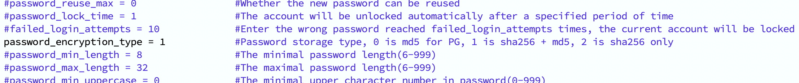
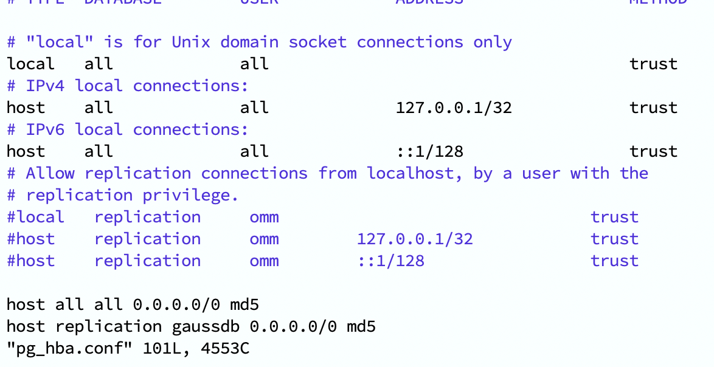
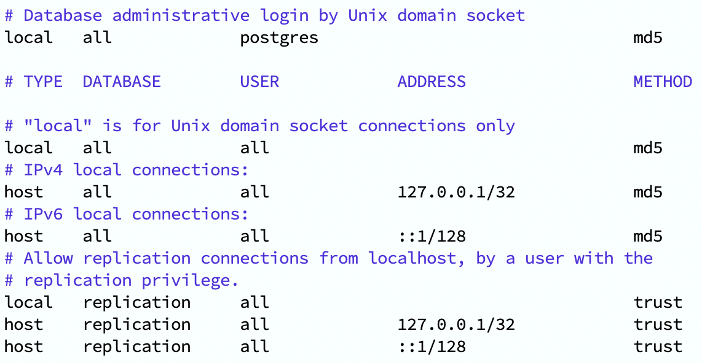

# OpenGauss 与 PostgreSQL 在Mac Apple M1上的差异分析

---

OpenGauss 是由华为公司开发的一款开源数据库，它是基于 PostgreSQL 二次开发的。华为公司称 OpenGauss 是一款**高性能，高可用，高安全，易运维**的企业级开源关系型数据库，特别适用于复杂的数据密集型场景。本项目重点关注 OpenGauss DB 与 PostgreSQL 的性能差异，设计了一系列测试场景，使用**Sysbench**工具进行实验。同时，本项目还会讨论 OpenGauss 的安全特性，分析其优势。

---

测试代码及结果仓库：[EarendelH/DatabaseH_project3](https://github.com/EarendelH/DatabaseH_project3)

## 测试环境及工具

- **测试环境**：**Docker**
  - **CPU**：Apple M1 8-core
  - **内存**：8GB
  - **操作系统**：Debian GNU/Linux 10 (buster)
  - **Architecture**: aarch64
  - **OpenGauss数据库版本**：OpenGauss 3.0.0
  - **PostgreSQL数据库版本**：PostgreSQL 11.16

>说明：为了保持测试环境的一致性，我在搭载了 OpenGauss 3.0.0 的 Docker 容器中额外安装了 Postgresql 进行测试，因此Postgresql的版本为11.6而不是最新的16。

- **测试工具**：**Sysbench**
  - Sysbench 是一款开源的多线程性能测试工具，它支持多种数据库引擎，包括 MySQL、PostgreSQL等。Sysbench 可以模拟多种负载场景，如 OLTP、只读、只写等，是测试数据库性能的常用工具。本项目将会使用 Sysbench对两种数据库进行压测。

## 使用docker环境

>特别注意：在Apple M系列芯片上，OpenGauss的版本不能超过3.0.0，否则会出现`cgroup`的相关问题。

```bash
docker run --name opengauss_300 --privileged=true \
 -d -e GS_PASSWORD=<Your password> \ #openGauss password 必须包含大小写字母、数字、特殊字符，且长度不小于8位，如：'Test@1234'
 -v /Users/root/opengauss_300:/root -u root \
 -p 15432:5432 \
 enmotech/opengauss:3.0.0

```

成功拉取镜像后，可以通过以下命令进入容器并启动opengauss：

```bash
docker exec -it opengauss_300 bash
su omm
gsql 

```

## 安装PostgreSQL

此docker环境下的软件管理工具为`apt`，但是需要更新，否则会导致找不到软件包的问题。

需要在root用户下执行以下命令，不要切换到omm：

```bash

apt-get update #docker上的镜像源已经被修改，根据网络情况可能会失败，多试几次
apt-get install postgresql postgresql-client

su postgres
psql

```

## 安装Sysbench

```bash

apt -y install make automake libtool pkg-config libaio-dev
apt -y install libpq-dev
apt-get curl
curl -s https://packagecloud.io/install/repositories/akopytov/sysbench/script.deb.sh | sudo bash
apt -y install sysbench
  
```

## 配置Opengauss

为了使得Sysbench能够连接到OpenGauss和PostgreSQL数据库，需要修改`postgresql.conf`和`pg_hba.conf`文件，使压测工具能够连接数据库。

首先登录omm用户并进入openGauss数据库，找到`pg_hba.conf`文件的路径：

```bash
omm=#show hba_file；
              hba_file               
-------------------------------------
 /var/lib/opengauss/data/pg_hba.conf
(1 row)
```

进入该路径`/var/lib/opengauss/data/`,修改`postgresql.conf`文件，将`password_encryption_type=2`修改为1，同时支持sha256和md5。



>说明：OpenGauss默认的加密方式为仅sha256，即`password_encryption_type=2`，而sysbench不支持sha256加密方式，因此需要修改为md5。

修改`pg_hba.conf`文件，将所有`sha256`或者`scram-sha-256`以及`peer`修改为`md5`或`trust`，这样sysbench才能够连接到数据库。



修改完成后，重启数据库：

```bash
gs_ctl restart -D /var/lib/opengauss/data
```

在omm用户下登录到数据库，创建一个测试数据库及测试用户：

```sql
create database sbtest;
create superuser sbtest with password 'test@1234';
grant all privileges on database sbtest to sbtest;
```

配置成功后可以用一下命令测试sysbench能否正常测试

```bash
sysbench --threads=8 --time=30 --report-interval=1 --db-driver=pgsql select_random_ranges --pgsql-host=localhost --pgsql-port=5432 \
--pgsql-user=sbtest  --pgsql-password=test@1234  --pgsql-db=sbtest --tables=2 --table-size=1000000 run
```

## 配置PostgreSQL

进入PostgreSQL数据库，同样的方法找到`pg_hba.conf`文件的路径：

>提醒，如果在安装postgresql后关闭了镜像，再次进入时需要重新启动postgresql服务。

```bash
service postgresql start
```

```bash

postgres=#show hba_file；
              hba_file               
-------------------------------------
 /etc/postgresql/11/main/pg_hba.conf
(1 row)
```

同样的方法修改`pg_hba.conf`文件，不过是将`peer`修改为`md5`或`trust`，这样sysbench才能够连接到数据库。



修改完成后，重启数据库：

```bash
service postgresql restart
```

在postgres用户下登录到数据库，创建一个测试数据库及测试用户：

```sql
create database sbtest;
create superuser sbtest with password 'sbtest';
grant all privileges on database sbtest to sbtest;
```

配置成功后可以用一下命令测试sysbench能否正常测试

```bash
sysbench --threads=8 --time=30 --report-interval=1 --db-driver=pgsql select_random_ranges --pgsql-host=localhost --pgsql-port=5434 \
--pgsql-user=sbtest --pgsql-password=sbtest --pgsql-db=sbtest --tables=2 --table-size=1000000 run
```

>注意：PostgreSQL的默认端口为5434，5432已经被OpenGauss占用。

## sysbench测试

sysbench已经设置了许多测试场景脚本，使用lua语言编写，可以直接调用。有能力者也可以自己编写测试脚本，设置不同参数。

脚本位置`/usr/share/sysbench/*.lua`。

| 脚本名                      | 场景描述                  |
|-----------------------------|---------------------------|
| bulk_insert.lua             | 批量插入                  |
| oltp_insert.lua             | OLTP 插入                 |
| oltp_point_select.lua       | OLTP 点查询               |
| oltp_update_non_index.lua   | OLTP 非索引更新           |
| oltp_update_index.lua       | OLTP 索引更新             |
| oltp_delete.lua             | OLTP 删除                 |
| oltp_read_only.lua          | OLTP 只读                 |
| oltp_write_only.lua         | OLTP 只写                 |
| oltp_read_write.lua         | OLTP 读写                 |
| oltp_common.lua             | OLTP 通用                 |
| select_random_points.lua    | 随机点查询                |
| select_random_ranges.lua    | 随机范围查询              |

我已经在项目中编写了批量测试脚本`job.sh`和`bulk.sh`，可以自行修改参数并使用。

```bash
job_names=("oltp_insert" "oltp_point_select" "oltp_update_non_index" "oltp_update_index " "oltp_delete " "oltp_read_only" "oltp_write_only" "oltp_read_write" "select_random_points" "select_random_ranges") #使用的测试场景
threads=8 #线程数
time="600" #测试持续时间
port="5434" #数据库端口
tables_=(4) #表数，可以设置多个，通过循环批量测试
table_size=1000000 #表大小
```

## 测试结果

测试结果日志在`pg_bench`和`og_bench`文件夹中，可以查看。

具体的测试结果和分析请查看[测试报告](./project3_report.pdf)。

## 写在最后

感谢于老师和助教的指导，让我学到了很多关于数据库性能测试的知识。同时，也感谢华为公司开源了OpenGauss数据库，此次项目让我受益匪浅。