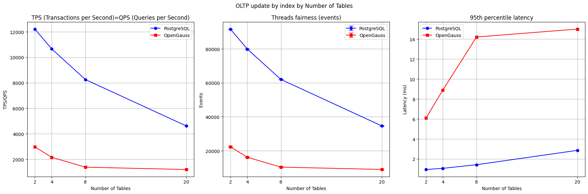

# OpenGauss 与 PostgreSQL 在Mac Apple M1上的差异分析

## 摘要

OpenGauss 是由华为公司开发的一款开源数据库，它是基于 PostgreSQL 二次开发的。华为公司称 OpenGauss 是一款**高性能，高可用，高安全，易运维**的企业级开源关系型数据库，特别适用于复杂的数据密集型场景。本项目重点关注 OpenGauss DB 与 PostgreSQL 的性能差异，设计了一系列测试场景，使用**Sysbench**工具进行实验。同时，本项目还会讨论 OpenGauss 的安全特性，分析其优势。

关键词：OpenGauss，PostgreSQL，数据库性能。

测试代码及结果仓库：[EarendelH/DatabaseH_project3](https://github.com/EarendelH/DatabaseH_project3)

## 测试环境及工具

- **测试环境**：**Docker**
  - **CPU**：Apple M1 8-core
  - **内存**：8GB
  - **操作系统**：Debian GNU/Linux 10 (buster)
  - **Architecture**: aarch64
  - **OpenGauss数据库版本**：OpenGauss 3.0.0
  - **PostgreSQL数据库版本**：PostgreSQL 11.16

>说明：为了保持测试环境的一致性，我在搭载了 OpenGauss 3.0.0 的 Docker 容器中额外安装了 Postgresql 进行测试，因此Postgresql的版本为11.6而不是最新的16。

- **测试工具**：**Sysbench**
  - Sysbench 是一款开源的多线程性能测试工具，它支持多种数据库引擎，包括 MySQL、PostgreSQL等。Sysbench 可以模拟多种负载场景，如 OLTP、只读、只写等，是测试数据库性能的常用工具。本项目将会使用 Sysbench对两种数据库进行压测。

## 评估标准

1. **TPS**：Transactions Per Second，每秒事务数，表示数据库处理能力的指标。
2. **QPS**：Queries Per Second，每秒查询数，表示数据库查询能力的指标。
3. **Latency 95%**：95% 响应时间，可以表示大部分请求的响应时间。可以用来评估数据库的通信效率。
4. **Threads fairness**: 表示多线程公平性，方差值越接近0表示越公平。可以用来评估数据库的并发处理能力。

## 场景及测试结果

本项目设计了**九个**测试场景，**数据库中的表大小为100万行**，符合大型数据库的特点。

由于测试机器cpu有8个计算核心，因此设计了表数量2，4，8，20四种情况，分别表示小于、等于、大于核心数的情况，以测试数据库的并发处理能力。

以下图表只选择了一部分测试结果，所有测试日志均已上传[github仓库](https://github.com/EarendelH/DatabaseH_project3)，可以查看具体的测试结果。

测试结果汇总为三个/四个折线图，分别代表TPS、QPS、Latency 95%、Threads events(每个线程上的任务数的平均值以及方差)。在某些场景中TPS=QPS，会只有三个折线图。绘图数据及代码在仓库中的`plot.ipynb`文件中。

**红色代表OpenGauss，蓝色代表Postgresql。**

### 场景一：大规模批量插入


### 场景二：OLTP Update by index

>OLTP 是一种常见的负载场景,具有高并发、高频率的特点，例如银行交易系统、电商系统等，符合本次项目的测试目的。



### 场景三：OLTP Delete


### 场景四：OLTP Read-Only 只读事务


### 场景五：OLTP Write-Only 只写事务


### 场景六：OLTP Read-Write 读写事务


### 场景七：select random points 查询单点随机数据


### 场景八：select random ranges 查询随机范围数据


### 场景九：长时间性能压力测试 

以oltp_read_write运行10分钟为例


### 性能对比

遗憾的是，从测试结果来看，**OpenGauss的性能在大部分场景下都不如PostgreSQL**。除了范围查询外，在设计的所有场景中OpenGauss的**TPS、QPS均明显低于**Postgresql，**延迟也更高**。并行性能上，虽然OpenGauss的**方差值更小，但在平均值上远低于Postgresql**，这在一定程度上说明**OpenGauss的并发处理能力是不如Postgresql的**。

在范围查询场景中，OpenGauss的性能表现更好，TPS、QPS、延迟都优于Postgresql。这可能是因为OpenGauss在设计时的一些优化策略，例如**索引优化**、使得OpenGauss在范围查询场景下表现更好。但是与之相矛盾的Updata by index场景中，说明**精确查询上的低性能并不是范围查询优化所能弥补的**。此场景中OpenGauss的**并行任务分配方差也十分高，发挥并不稳定**。

在长时间性能压力测试中，OpenGauss的性能表现也不如Postgresql，TPS、QPS、延迟都明显高于Postgresql。

值得一提的是在大部分情况中，**OpenGauss的性能波动幅度相比于Postgresql更小**，某种程度上说明OpenGauss的**稳定性可能更好**。

## OpenGauss 相比较于 PostgreSQL 的安全特性

1. 密码安全策略：OpenGauss的密码安全策略更加严格，postgresql只需要满足密码长度要求即可，而OpenGauss还需要包含大小写字母、数字、特殊字符等。

2. 登录密码检验加密：在配置sysbench进行测试时，**我发现**，对于OpenGauss,其`pg_hba.conf`文件中的`password_encryption`参数默认为`2`,即**使用SHA256加密算法**，而Postgresql默认为`1`，即使用MD5加密算法。在离散数学的学习中，我们知道**MD5现在已经是可以被破解的，而SHA256则更加安全**。

3. openGauss防篡改账本数据库

OpenGauss引入了防篡改账本数据库功能,在用法上与普通表没有区别，但是在实现上，OpenGauss会在表的每一行数据后面**加上一个哈希值**，从而实现**数据的防篡改以及对数据的全流程进行追踪审计。**


```sql
db=# create schema ledger with blockchain;
db=# create table ledger.user(id int, name varchar);
db=# insert into ledger.user values(1, 'alex'), (2, 'bob’);
db=# select *, hash from ledger.user;
 id | name |       hash
----+------+------------------
  1 | alex | 1f2e543c580cb8c5
  2 | bob  | 8fcd74a8a6a4b484
(2 rows)
db=# select * from blockchain.ledger_user_hist limit 1;
-[ RECORD 1 ]------------------------------
rec_num  | 0
hash_ins | 1f2e543c580cb8c5
hash_del |
pre_hash | b62faf1967d78a3043a2b4ea5cc075d2
db=# select blocknum, username, starttime, relhash, txcommand from gs_global_chain limit 1;
-[ RECORD 1 ]-----------------------------------------------------
blocknum  | 28
username  | omm
starttime | 2024-12-10 11:20:34.202908+08
relhash   | aefbc8e4feb16d49
txcommand | insert into ledger.user values(1, 'alex'), (2, 'bob');


```

防篡改表的数据变更历史记录

```sql

           starttime           |                        txcommand                                   |  data_ins  | data_del
-------------------------------+--------------------------------------------------------------------+------------+--------------
 2024-12-12 11:22:22.168519+08 | insert into ledger.t1 values(1, ‘alex’), (2, ‘bob’), (3, ‘peter’); | 1, ‘alex’  | 
 2024-12-12 11:22:22.168519+08 | insert into ledger.t1 values(1, ‘alex’), (2, ‘bob’), (3, ‘peter’); | 2, ‘bob’   | 
 2024-12-12 11:22:22.168519+08 | insert into ledger.t1 values(1, ‘alex’), (2, ‘bob’), (3, ‘peter’); | 3, ‘peter’ |
 2024-12-12 11:22:22.170443+08 | update ledger.t1 set name = ‘bob2’ where id = 2;                   | 2, ‘bob2’  | 2, ‘bob’ 
 2024-12-12 11:22:22.171845+08 | delete from ledger.t1 where id = 3;                                |            | 3, ‘peter’
 2024-12-12 11:22:22.173231+08 | update ledger.t1 set name = ‘bob3’ where id = 2;                   | 2, ‘bob3’  | 2, ‘bob2’

```

## 结论

尽管此次项目的目标是测试OpenGauss在哪些方面优于Postgresql，但从大规模的测试结果来看，OpenGauss的性能在大部分场景下其实**不如Postgresql**。或许是因为**OpenGauss是针对华为的鲲鹏处理器以及OpenEuler操作系统进行优化的**，而我的测试环境是在Apple M1芯片上，操作系统是低版本的Debian因此导致了OpenGauss的性能表现不佳。此次使用的OpenGauss版本3.0.0**并不是最新版本**，此外，OpenGauss的文档中也提到了其对于**多cpu进行了NUMA改造**，这也是一个值得测试的方向。由于设备与时间限制，无法进行更多的测试，**期待新版本在华为生态硬件上能够有更好的性能表现**。

